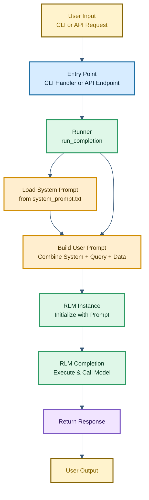
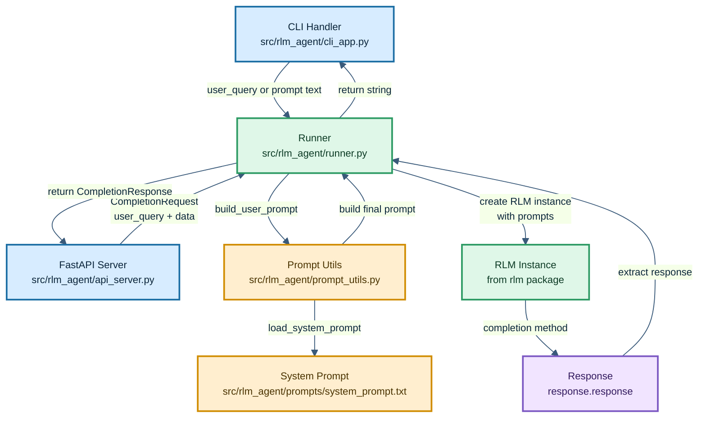
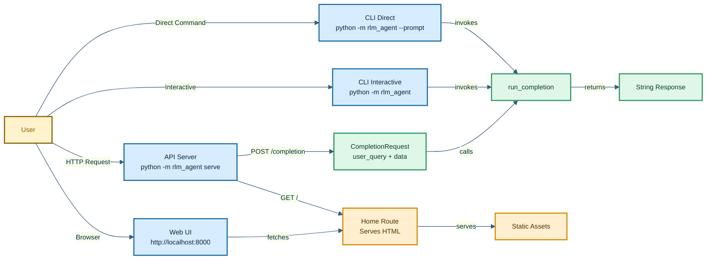
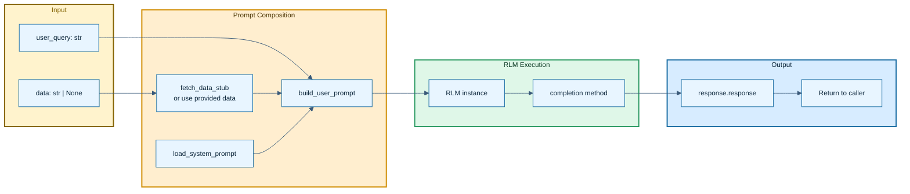

# RLM Agent - Detailed Architecture

## System Lifecycle

How a request flows through the system from entry point to response:

## Component Interaction

How the major components communicate with each other:

## Entry Points

How users interact with the RLM Agent:

## Data Flow

How data moves from input to output:

## Component Glossary

### Entry Points (src/rlm_agent/)
- **cli_app.py** — Typer CLI with three modes: direct prompt (`--prompt`), interactive prompt, or serve command. Handles host/port configuration.
- **api_server.py** — FastAPI application with `/health` and `/completion` endpoints. Mounts static files and web router. Returns HTTP 503 on errors.
- **runner.py** — Shared orchestrator called by both CLI and API. Coordinates prompt building, RLM initialization, and response extraction.

### Prompt Layer (src/rlm_agent/)
- **prompt_utils.py** — Core functions: `load_system_prompt()` reads from file, `build_user_prompt()` combines system prompt, data, and user query.
- **prompts/system_prompt.txt** — Base instruction template for the model.
- **Data retrieval** — Currently stubbed with `fetch_data_stub()` placeholder. Optional data can be passed via API or CLI.

### Web Layer (src/rlm_agent/web/)
- **routes.py** — FastAPI router serving GET `/` endpoint that returns HTML response.
- **templates/index.html** — Web UI template for browser interaction.
- **static/site.css** — Web UI styles.
- **static/app.js** — Web UI client-side JavaScript.

### RLM Integration
- **RLM class** — External package imported in runner.py. Initialized with backend (LM provider), model name, system prompt, and verbose flag.
- **backend** — LM provider selection (Anthropic, OpenAI, Gemini, etc.). Set via MODEL environment variable.
- **backend_kwargs** — Additional config like `model_name` passed to RLM.
- **Execution environments** — Managed internally by RLM package (Local, Docker, Modal, E2B, Daytona, Prime).

### Request/Response Models
- **CompletionRequest** — Pydantic model with `user_query: str` and `data: str | None`.
- **CompletionResponse** — Pydantic model with `response: str`.

### Configuration (environment variables)
- **MODEL** — LM backend provider (e.g., "gemini", "openai").
- **MODAL_NAME** — Model name passed to backend (e.g., "gpt-4", "claude-3-opus").
- **VERBOSE_MODE** — Enable verbose logging (default: "false").
- **HOST** — Server bind address (default: "0.0.0.0").
- **PORT** — Server port (default: "8000").

### Core Types (rlm/core/types.py)
- **Message** — Individual message in conversation history
- **Response** — Structured response containing code, output, and metadata
- **CompactionMetadata** — Information about session compaction/history management
- **DepthMetadata** — Metadata tracking execution depth and complexity

### Utilities
- **Token Utils** — Manages token counting and rate limiting
- **Parsing** — Extracts code blocks and structured content from model responses
- **RLM Utils** — Helper functions for session management and data handling
- **Exceptions** — Custom exception types for error handling
- **Logger** — Verbose and structured logging for debugging and monitoring
