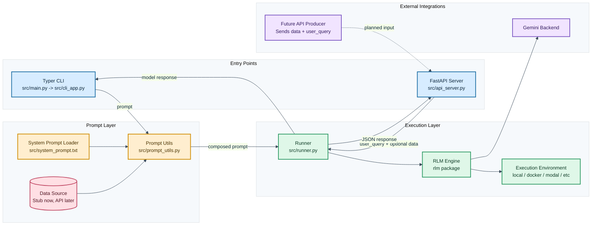

# RLM agent

A general purpose connector to run LLMs in a RLM harness.

## Architecture

- CLI and API share the same runner.
- Prompt composition is centralized in src/prompt_utils.py.
- The runner is the only place that configures and calls RLM.
- FastAPI accepts user_query plus optional data payload.
- Data retrieval is stubbed now and can be replaced by producer API.
- Website is served at / through src/web/routes.py with static assets in src/web/static/.
- API errors from model/backend calls are returned as HTTP 503 with details.

## Usage (user)

- CLI direct: python src/main.py --prompt "your question"
- CLI interactive: python src/main.py
- API mode (preferred): python src/main.py serve
- API mode (legacy flag): python src/main.py --serve-api
- Render deploys: the server binds to HOST/PORT automatically (defaults: 0.0.0.0:8000).
- Local override example: python src/main.py serve --host 127.0.0.1 --port 8000
- Website: open http://127.0.0.1:8000/ after starting API mode.
- Interactive UI can send user_query + optional data directly to POST /completion.
- API docs: http://127.0.0.1:8000/docs
- TODO: add curl examples

## Usage (developer)

- Core files:
- src/main.py
- src/cli_app.py
- src/api_server.py
- src/runner.py
- src/prompt_utils.py
- src/web/routes.py
- src/web/templates/index.html
- src/web/static/site.css
- src/web/static/app.js
- Edit src/system_prompt.txt to tune default behavior.
- Keep prompt assembly changes inside src/prompt_utils.py.
- Use python src/main.py --help to view CLI commands/options.
- TODO: add setup, test, and contribution details
