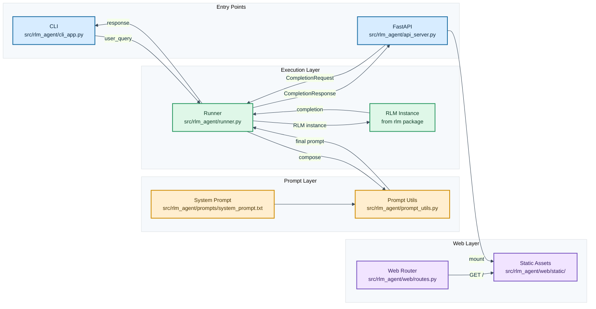

# RLM agent

A general purpose connector to run LLMs in a RLM harness.

## Architecture

- CLI and API share the same runner (src/rlm_agent/runner.py).
- Prompt composition centralized in src/rlm_agent/prompt_utils.py.
- Runner orchestrates prompt building, RLM initialization, and response extraction.
- FastAPI accepts CompletionRequest with user_query and optional data payload.
- Data retrieval uses fetch_data_stub() placeholder (can be replaced with actual API integration).
- Website served at / through src/rlm_agent/web/routes.py with static assets in src/rlm_agent/web/static/.
- API errors from RLM calls are returned as HTTP 503 with exception details.

## Usage (user)

- CLI direct: `python -m rlm_agent --prompt "your question"`
- CLI interactive: `python -m rlm_agent`
- API mode: `python -m rlm_agent serve`
- Local development: `python -m rlm_agent serve --host localhost --port 8000`
- Render deploy: Server binds to HOST/PORT automatically (defaults: 0.0.0.0:8000)
- Deployment: `HOST=0.0.0.0 PORT=8000 python -m rlm_agent serve`
- Website: Open http://localhost:8000/ after starting API mode
- Interactive UI: Send user_query + optional data to POST /completion
- API docs: http://localhost:8000/docs

## Usage (developer)

- Core files:
- src/main.py
**Core files:**
- `src/rlm_agent/cli_app.py` — Typer CLI entry point
- `src/rlm_agent/api_server.py` — FastAPI server and routes
- `src/rlm_agent/runner.py` — Shared orchestrator
- `src/rlm_agent/prompt_utils.py` — Prompt composition logic
- `src/rlm_agent/prompts/system_prompt.txt` — Base system instructions
- `src/rlm_agent/web/routes.py` — Web UI router
- `src/rlm_agent/web/templates/index.html` — Web UI template
- `src/rlm_agent/web/static/site.css` — Web UI styles
- `src/rlm_agent/web/static/app.js` — Web UI client script

**Configuration (environment variables):**
- `MODEL` — LM backend (e.g., "gemini", "openai", "anthropic")
- `MODAL_NAME` — Model name passed to backend
- `VERBOSE_MODE` — Enable RLM verbose logging (default: "false")
- `HOST` — Server bind host (default: "0.0.0.0")
- `PORT` — Server bind port (default: "8000")

**Development:**
- Edit `src/rlm_agent/prompts/system_prompt.txt` to tune default behavior
- Keep prompt assembly changes in `src/rlm_agent/prompt_utils.py`
- Use `python -m rlm_agent --help` to view CLI commands
- See Architecture.md for detailed component diagram